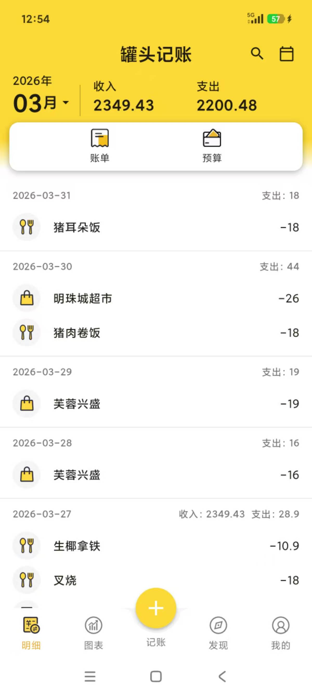
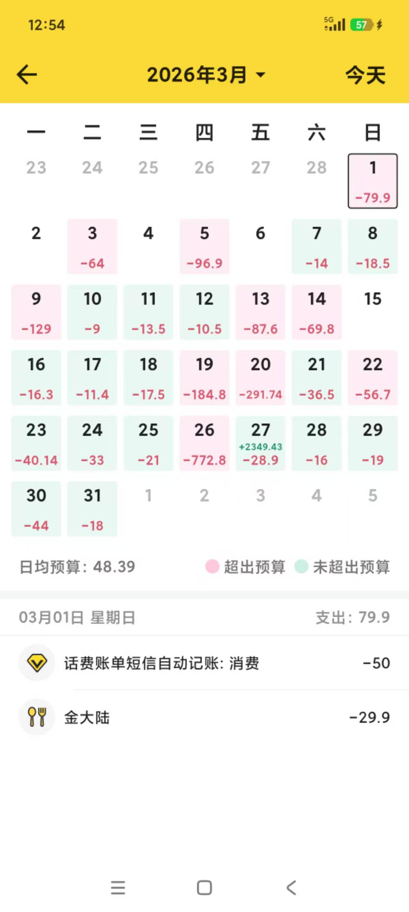
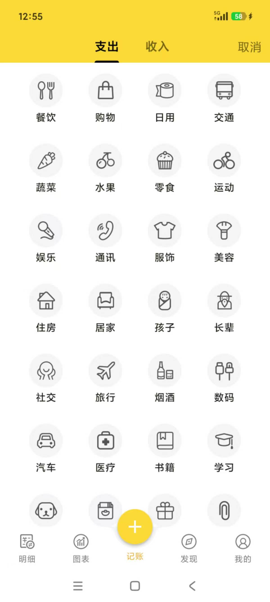
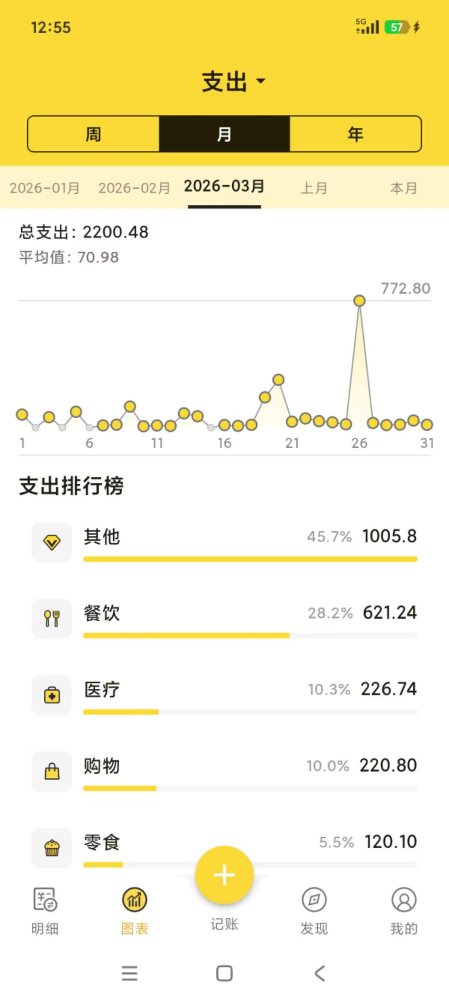
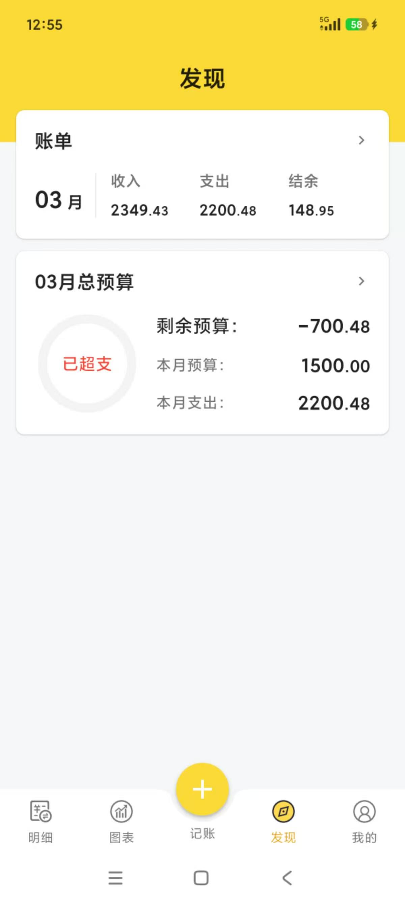
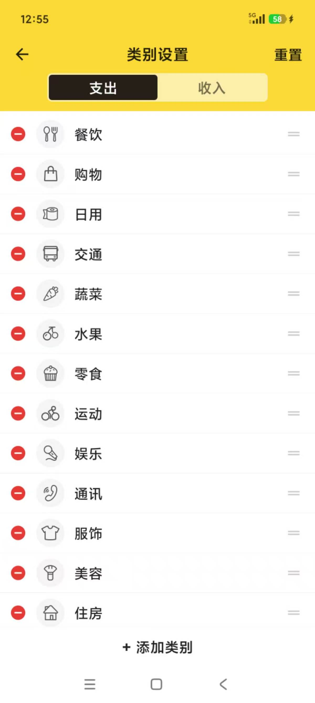
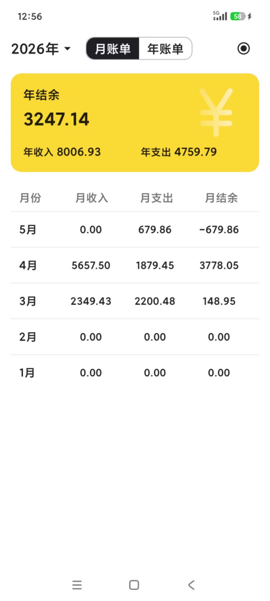
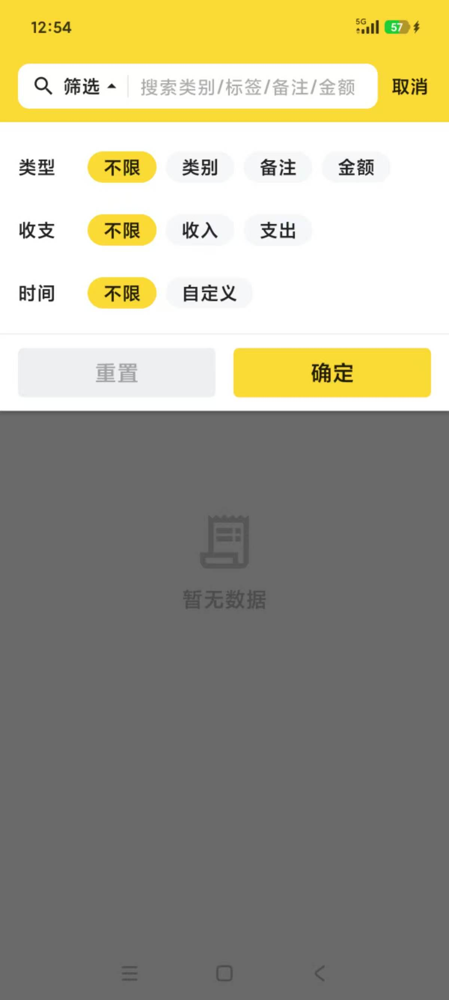

# bunny记账

## 基于Flutter的个人记账应用

**目录下有apk文件自行下载体验**

- 记账功能（增删改查）
- 月/年账单功能
- 周/月/年折线图表功能
- 自定义记账类别
- 月度/年度预算功能
- 搜索功能（金额、备注、类别、时间）
- 银行短信自动记账功能
- 记账成就面板

todo：

- [ ] 数据恢复
- [ ] 记账标签
- [x] 记账日历
- [ ] 饼图分析
- [ ] 图片备注
